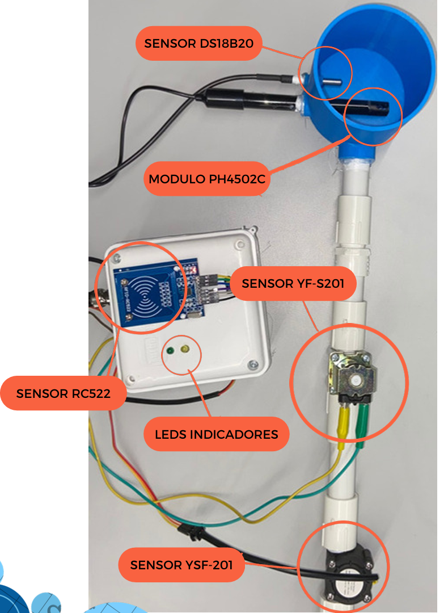
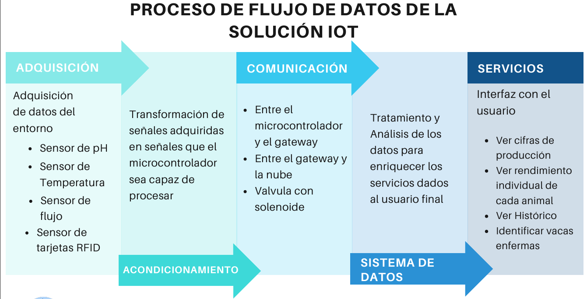

# COW-DAL: IoT-Based Dairy Monitoring System

## Table of Contents

- [Overview](#overview)
- [Problem Statement](#problem-statement)
- [Solution: COW-DAL](#solution-cow-dal)
- [Sensors and Technologies](#sensors-and-technologies)
- [How It Works](#how-it-works)
- [Benefits for Farmers](#benefits-for-farmers)
- [System Architecture](#system-architecture)
- [Project Resources and Demonstration](#project-resources-and-demonstration)
- [Repository Structure](#repository-structure)
- [Contributors](#contributors)
- [License](#license)

---

## Overview

COW-DAL is an **IoT-based data acquisition module** designed to enhance the efficiency and traceability of **mechanical milking systems** in small and medium-sized dairy farms. By integrating real-time **pH, temperature, flow rate, and total volume sensors**, along with an **RFID-based cow identification system**, COW-DAL provides farmers with **valuable insights into milk production, herd health, and operational efficiency**.

Farmers can monitor **historical and real-time production data** from **any internet-connected device**, allowing for better decision-making, early health issue detection, and overall process optimization.

(<a href="#readme-top">Back to top</a>)

---

## Problem Statement

Despite the growing adoption of mechanical milking in Colombia, dairy farmers face several challenges:

1. **Inefficient Data Collection**  
   - Lack of accurate, real-time milk production records for each cow.  
   - Difficulty in managing farm resources and estimating overall production.  

2. **Lack of Individual Tracking & Monitoring**  
   - No historical data per cow to identify trends in milk production.  
   - Limited ability to assess the impact of nutrition, environment, or herd management.  

3. **Difficulty in Detecting Health Issues**  
   - Abrupt changes in milk production can indicate **stress, disease, or poor nutrition**.  
   - Without proper tracking, early signs of health issues are often overlooked, leading to potential outbreaks.  

(<a href="#readme-top">Back to top</a>)

---

## Solution: COW-DAL  

COW-DAL is a **plug-and-play monitoring system** that integrates seamlessly with **existing mechanical milking stations**.

### Key Features
- Real-time monitoring of pH, temperature, milk flow, and total volume.
- Automated cow identification using RFID technology.
- Cloud-based dashboard for easy access to historical and live data.
- Health tracking and early issue detection based on production fluctuations.
- User-friendly interface for small and medium-sized dairy farmers.

(<a href="#readme-top">Back to top</a>)

---

## Sensors and Technologies  

COW-DAL utilizes the following sensors to collect real-time dairy production data:

### Milk Quality Monitoring
1. **DS18B20 Temperature Sensor**  
   - Measures **milk temperature** during milking to **prevent contamination**.  
   - Normal range: **36°C - 39°C (98.6°F - 102.2°F)**.  
   - Uses **One-Wire protocol** with **0.0625°C accuracy**.  

2. **PH4502C Liquid pH Sensor**  
   - Monitors **milk acidity levels** to detect **potential spoilage**.  
   - Normal raw milk pH: **6.4 - 6.8**.  
   - Uses an electrode-based system that converts **pH variations into voltage signals**.  

### Milk Volume & Production Tracking
3. **YF-S201 Flow Sensor**  
   - Measures **milk flow rate and total volume** collected during milking.  
   - Uses a **Hall-effect principle** to detect liquid movement inside a propeller.  

### Cow Identification & Data Logging
4. **RC522 RFID Sensor**  
   - Identifies **each cow individually** at the milking station.  
   - Stores **production and health records** per cow.  
   - Uses the **SPI communication protocol** for fast data processing.

### Physical Assembly and Implementation

(<a href="#readme-top">Back to top</a>)

---

## How It Works

1. The cow enters the milking station and is identified via **RFID scanning**.  
2. The milking process begins, and sensors measure **temperature, pH, flow rate, and total volume**.  
3. The collected data is **transmitted to the cloud**, where farmers can access real-time and historical production records.  
4. The system **analyzes milk production trends** to detect early signs of health issues.  

(<a href="#readme-top">Back to top</a>)

---

## Benefits for Farmers

- **Improved efficiency**: Automates data collection and minimizes manual record-keeping.  
- **Better herd management**: Tracks individual cow performance over time.  
- **Early health issue detection**: Identifies abnormal production drops to prevent disease spread.  
- **Higher milk quality**: Ensures only **fresh and safe milk** enters the storage tanks.  
- **Data-driven decision-making**: Helps optimize feeding, herd rotation, and farm resources.  

(<a href="#readme-top">Back to top</a>)

---

## System Architecture  

- **Data Collection** → IoT sensors capture real-time values.  
- **Data Transmission** → Microcontroller (Raspberry Pi 3B+) processes and sends data to the cloud.  
- **Data Visualization** → Farmers access insights via web dashboard.

(<a href="#readme-top">Back to top</a>)

---

## Project Resources and Demonstration

### Web Page
https://cow-dal.web.app/

### Customer Interface (Dashboard)
https://demo.thingsboard.io/dashboard/fd3c2300-8cda-11ee-814c-b71f5ae1ccd8?publicId=ac6d21e0-8cd5-11ee-a3dc-0344286b9b83

### Video Phase 2 (Spanish)
- Explanatory video of the web application
- Firebase: hosting, authentication and database
- Raspberry python code
- Demonstration of sending data to Thingspeak

https://youtu.be/NCL13GEN7jk

(<a href="#readme-top">Back to top</a>)

---

## Repository Structure  

- **`/Raspberry`** - Source code for microcontroller (Raspberry Pi 3B+).  
- **`/WebDevelopment`** - Website and dashboard design, database connection.
- **`/MATLAB_files`** - Matlab file that plots the information received in the ThingsPeak channel for each variable (old dashboard).
- **`/Imgs`** - Project images

(<a href="#readme-top">Back to top</a>)

---

## Contributors  

This project was developed by:  

- **Jose Miguel Torres** (torresj-o@javeriana.edu.co)  
- **Nicolas Perez** (nicolasperezc@javeriana.edu.co)
- **Roberto Cuervo** (ra.cuervo@javeriana.edu.co)

(<a href="#readme-top">Back to top</a>)

---

## License  

This project is licensed under the **GNU General Public License v3.0**.  
See the full license in the [`LICENSE`](LICENSE) file.  

(<a href="#readme-top">Back to top</a>)

